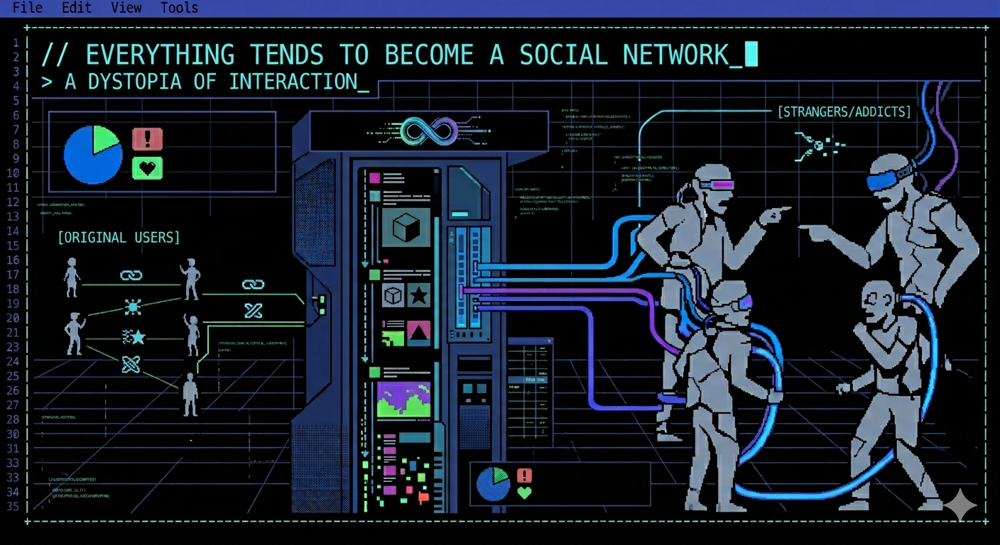

Date: 2026-04-25

# On How Everything Becomes a Social Network: The Disease

Many years ago I had a Twitter account. For different reasons, I had some followers
and I was engaged. However, after a couple of years, I realized how much it was
ruining my mood. The amount of interactions with random people, some looking to
vent, others misunderstanding everything everyone could say... I realized the
problem was the format: 160 characters at the time. It was not a place to
discuss, share or answer in nuance ways, with details and understanding. It was
an attention machine.

I left. Deleted the account. Forgot about it. But if we are something, are
animals tha trip twice on the same stone. So I decided to be smart about it. I
created an account just for programming, tech news and such. I would avoid the
trending topics, the fights, the bait... And it was great! Reading thoughts of
impressive professionals like John Carmack, Cassey Murattori, seeing projects
people where working on... but didn't last long.

It may be me, but I have the impression that the algorithms are design to bait
you, to enrage you and to make you interact and react. If I think about it,
probably after the monetization of the Premium accounts, that started to be
worst. People were trying to monetize their accounts, as they were paying, which
means people (at least some) were looking to write more shocking statements to
drive engagement.

On top of that, the Language Wars, particularly Rust versus C, C++ and some
others, was also ruining my experience. Then I realized that I was getting
hooked, not because of the benefits it gave me, like learning new things,
reading interesting ideas... but based on rage, offense and other negative
feelings. So I uninstalled it. The chance of making money ruined it. The same
way the chance of pushing certain ideas ruined it before Musk.

## The Principal Rotten Network: LinkedIn

Nothing new here, but it is a paradigmatic example. LinkedIn started as a social
network to connect employers with employees. More like a job market. I don't
think it was a social network at the beginning. However, it started to become
that very fast. Why? Well, the problem with being a job posting place, or a job
marketplace, is that once people get a job and once a company filled their
roles, they do not go back again.

So the people at LinkedIn realized that they could make it more like a network
place, where you could connect with others in your sector, not just for finding
a job or a worker. To be honest, the idea was not really bad. However, it went
to shit fast too. Now it is a terrible place. Everyone is pretending to be
amazing, thanking the company that just fired them for the opportunity it gave
them, pretending CEOs writing the most insane things, mostly false, about
learning and growing experiences when their mother died in a ditch... pure
narcissism and psychopathy.

But it is not only that. Think about it: why would you write an honest opinion
about the company that fired you for reasons you consider stupid or unjust? Now
you need a new job, and the same success of LinkedIn was, in my opinion, its
death. Because everyone is there, if you appear there being upset, criticizing
the previous company, your chances to get a new job will hardly be reduced. HR
and recruiters will check what you were doing there (obviously) and maybe even
contact or check the previous company. If you are there angry about your
firing... that is bad. Looks bad. And people is not stupid. At least, not
everyone is.

So then, only two real strategies developed there:

- Be an hypocrite and play the game. That is, writing bullshit, "inspiring
  thoughts" and sucking up to connected executives and companies to try to
  advance in their careers.
- To avoid that by barely interacting there. Only when one needs a job, spend
  some time refreshing the profile, updating information and buttering up the
  resume until a job is found.

In my case, it is the latter. And even then, it is a miserable experience. I was
even desperate to get a job in order to being able to delete the app from my
phone and close the tab in the browser.

Why the owners did that instead of finding ways to make it more useful? We
don't need it to be engaging or for connecting with people, but useful to get a
job and improve our career prospects. I thought that was the point of the
learnig section... but it was not. It is an excuse to keep playing the game of
the "social network for workers and companies". The final reason they did that
is obvious: it makes more money. Or maybe makes more money per unit of
investment and effort.

## What I Thought Would be My New Network

At the end of the day, one of the attractive thing of social networks is that it
helps fill those empty blocks of time during the day. Do you have to wait 15
minutes for a friend? Fire that thing up and you can see some funny memes, read
something interesting or watch a short video. And once I left Twitter, now X, I
felt that I would sometimes want to have something like that for when I did some
breaks on my job. A way to disconnect from the tasks and pressures form the day
to day job. And I thought of Substack.

A platform focused on blogs, where you could read from many people, many topics.
And sometimes there are long articles, but also there are articles you can read
in 10 minutes. Perfect then. I also happen to have a blog there where I write
maybe 4 or 5 times a year. So why not?

It was a bliss. Really, it has that part of social networks, the feed, where
people you follow or people that share articles or ideas about topics you are
interested in. It also helps you think in new ways about what to write, if you
happen to want to do that. And discuss with other interesting people in the
comments.

This has been going for a couple of months already. And with time, I could see
some patterns that disappointed me. The feed is not just to share thoughts or
articles... it is becoming similar to Twitter. Notes and feed is, more and
more, conformed by simplistic takes that drives interaction. Of feel-good
sentences too general to be meaningful in any way. And in everytime, there is a
comment from the author pointing you to their blog. And it is a blog created,
not for sharing honest thoughts or knowledge, but to monetize with product as
content. The goal is not sharing ideas or writings, but to drive monetization.
As Substack idea was to allow writers to make money using their platform.

## So Everything is Shit?

Well, no. I still like substack. At the end, it is a platform based on blogging
and writing articles. Long form articles, in general. The problem is that I am
old for this shit, as I saw it happening in the past. One idea that had success,
and once people is engaged, enshittify it to make money. I am old enough to
remember that Facebook was all about your friends, connecting with them,
organizing plans and sharing photos and comments. A totally different concept of
the Facebook of today. So I am afraid this will also
happen with Substack, given enough time.

So that leaves me with two thoughts:

1) Maybe it is about time to embrace those blocks of down time and learn how to
disconnect your mind. It is not a need to be doing anything at all, boredom is
actually good to make you mind wander and think.

2) I am ruminating the idea that maybe the problem with social networks is that,
we humans, we don't have the hardware needed for managing interactions with
million of strangers without any context on who are they. And that creates a
confusion, our brain filling the gaps and assuming many things about the other
person only based on a few hundred of characters. And it works very bad.

Perhaps that is the problem. We are not built to manage social networks in a
healthy way. For sure, the fact that the companies are hiring psicologists to
find out the best way to get us addicted doesn't help.

But I think there is something deeper on the point 2) above. Something worth 
thinking about in those idle blocks of time I have during the day.
